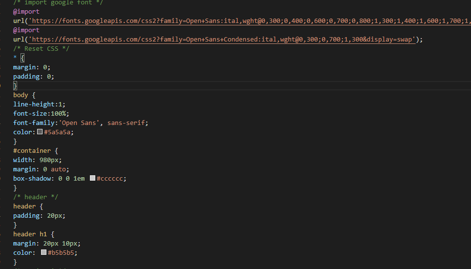

# Lab4web
untuk memenuhi tugas pemograman web 

Nama    : Antini permatasari 
NIM     : 312010095 
Kelas   : TI.20.B1 

Pratikum 4 
## 1. Langkah pertama Membuat Box Element
selanjutnya, kita buat dulu html Box Elementnya seperti dibawah ini. 
 
Maka kita lihat hasilnya seperti dibawah ini: 
 
Selanjutnya kita akan membuat CSS float property seperti dibawah ini: 
 
Maka kita Lihat hasilnya seperti dibawah ini: 
 

## 2. Langkah Kedua, Membuat Layout sederhana
Selanjutnya, kita buat dulu awalannya seperti dibawah ini: 
 
Dan kita tambahkan kode css seperti dibawah ini : 
 
setelah itu kita tambahkan juga navigasinya seperti dibawah ini : 
 
Dan kita lihat hasilnya seperti dibawah ini : 
 
Selanjutnya kita akan membuat Widget Header dan Widget Text dan kita akan menambahkan cssnya sebagai dibawah ini : 
 
Maka kita lihat hasilnya seperti dibawah ini: 
 
Selanjutnya kita mengatur footer 
kita lihat hasilnya seperti dibawah ini: 
 
Dan ini hasilnya : 
 
Selanjutnya lalu kita tambahkan Elemen lain pada main content 
 
Lalu kita tambahkan Cssnya seperti dibawah ini: 
 
Dan kita lihat hasilnya seperti dibawah ini : 
 
Setelah itu kita akan menambahkan Content Artikel seperti dibawah ini: 
 
Lalu kita tambahkan Cssnya seperti dibawah ini: 
 
Maka kita lihat hasilnya seperti dibawah ini: 
 

## Pertanyaan dan Tugas
 

## Jawaban 

Sekian Langkah-Langkah dari saya, kurang lebihnya mohon dimaafkan. 
Terimakasih....... 